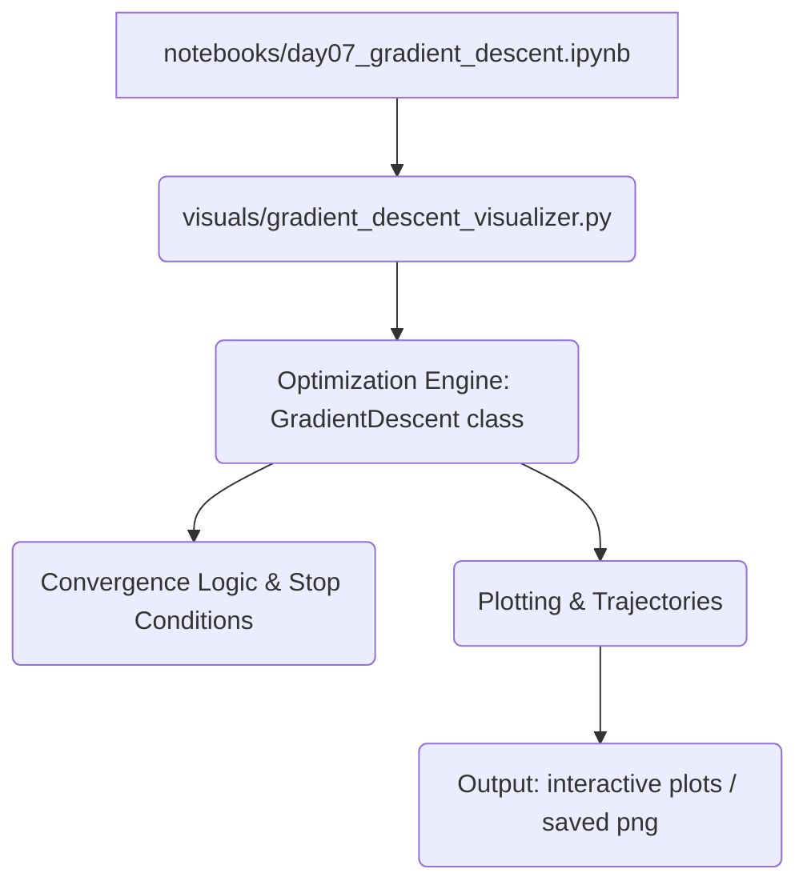

# 🧠 ML Math Foundations — Phase 2, Week A


Short summary
-------------
This repository is a rigor-first, from-scratch exploration of the mathematics that underpin machine learning. It focuses on building precise intuition about representation, derivatives, gradients, loss geometry, and optimization dynamics — delivered as small, reviewable, engineering-focused artifacts (not a library or production training system).

Execution summary
-----------------
- Scope: Phase 2 — Week A (7 consecutive concept notebooks)
- Artifacts: 7 mathematically-focused Jupyter notebooks + 1 decoupled optimization engine + visualizer
- Duration (suggested): Read sequentially — one notebook per day to preserve dependency ordering
- Engineering focus: numerical stability, vectorized implementations, shape-safety checks, and visualization-driven intuition

Why this matters
----------------
Understanding the math behind learning systems reduces brittle, trial-and-error engineering. This repo teaches:
- How data lives in vector spaces and how geometry affects predictions.
- How learning signals (derivatives/gradients) arise and propagate.
- How loss surfaces and curvature influence convergence and failure modes.
- How to implement shape-safe, numerically stable primitives you can reuse in later "From Scratch" projects.

Notebook gallery (7 days)
-------------------------
| Notebook | Core concept | Engineering value | Path |
|---|---:|---|---|
| Day 01 — Vectors | Data representation, magnitude, distance, similarity | Geometric intuition + shape checks | notebooks/day01_vectors.ipynb |
| Day 02 — Matrices & Dot Product | Datasets as matrices, matrix-vector multiplication | Prediction as linear alignment | notebooks/day02_matrices_dot_product.ipynb |
| Day 03 — Derivatives | Rate of change, numerical vs analytical derivatives | Stable finite-difference checks | notebooks/day03_derivatives.ipynb |
| Day 04 — Gradients | Partial derivatives, gradient vectors, steepest descent | Multi-parameter updates, shape-safe gradients | notebooks/day04_gradients.ipynb |
| Day 05 — Probability & Statistics | Mean, variance, noise, distributions | Understanding data variability and limits to prediction | notebooks/day05_probability_statistics.ipynb |
| Day 06 — Loss Functions | MSE, loss surfaces, curvature | Loss geometry and its effect on optimization | notebooks/day06_loss_functions.ipynb |
| Day 07 — Gradient Descent | Iterative updates, learning-rate effects, stopping logic | Reusable GD engine + diagnostic visualizer | notebooks/day07_gradient_descent.ipynb |

Core deliverables
-----------------
- notebooks/ (7 focused notebooks, one concept per file)
- visuals/gradient_descent_visualizer.py — decoupled optimization engine and visualization utilities
- README.md — this file
- (Optional) requirements.txt — small set of dependencies for running notebooks locally

Installation & Execution
------------------------
### Prerequisites
- Python 3.8+
- Jupyter (or JupyterLab), NumPy, Matplotlib

### Conceptual prerequisites (math)
- High school–level algebra
- Basic understanding of functions (for example: f(x), input → output)
- No prior machine learning knowledge is required — this repository builds ML concepts from first principles

### Quick setup & run
```bash
git clone https://github.com/vinay-2006/ml-math-foundations.git
cd ml-math-foundations
python3 -m venv venv
source venv/bin/activate
pip install -r requirements.txt        # if provided
jupyter notebook
```
Open and run notebooks sequentially (Day 01 → Day 07). Each notebook is designed to build on the previous.

Gradient Descent Visualizer (Day 07)
-----------------------------------
The visualizer demonstrates optimization dynamics and learning-rate experiments:
- Tracks parameter trajectories on low-dimensional loss surfaces
- Compares multiple learning rates to reveal convergence vs divergence
- Reports engineered stop conditions (max iterations, stagnation, divergence thresholds)

Architecture (high level)


A plot or GIF showing gradient descent trajectories on a loss surface should appear here when running the visualizer in the notebook or via the script. This visualization helps compare trajectories and loss curves produced by different learning rates.

> Image/GIF placeholder: Gradient descent trajectories on a loss surface (generated via visuals/gradient_descent_visualizer.py)

Quick demo (run in notebook)
```python
from visuals.gradient_descent_visualizer import run_lr_experiment
run_lr_experiment(learning_rates=[0.001, 0.01, 0.1], initial_params=[-2.0, 1.0])
```

Example Showcase — Gradient Descent Visualizer (Day 07)
-------------------------------------------------------
The visualizer demonstrates optimization dynamics and learning-rate experiments:
- Tracks parameter trajectories on low-dimensional loss surfaces
- Compares multiple learning rates to reveal convergence vs divergence
- Reports engineered stop conditions (max iterations, stagnation, divergence thresholds)

Repository Architecture
-----------------------
| Path | Category | Purpose | Status |
|---|---|---|---|
| notebooks/ | Educational Notebooks | Seven concept-scoped Jupyter notebooks, sequenced | Complete (7) |
| visuals/ | Tools & Visualizers | Gradient descent engine + plotting helpers | Complete |
| requirements.txt | Dependencies | Optional environment manifest | Optional |
| README.md | Documentation | High-level repo guide and usage | This file |

Testing
-------
This repository focuses on educational artifacts and currently does not include a formal test suite. Suggested checks:
- Run notebooks top-to-bottom to ensure cells execute without shape or type errors.
- Add small unit tests for the optimization engine (example: convergence on convex quadratic).

Notes & best practices
----------------------
- Notebooks are intentionally numerical and shape-safe: expect assertions for dimensional consistency.
- Keep one core concept per notebook to maintain reviewability.
- Visualizations are designed for intuition, not production plotting APIs.
- Data used in notebooks is synthetic and generated at runtime; no external datasets required.

Next Step — ML From Scratch 
---------------------------------------------
This repository provides the mathematical prerequisite for Phase 2, Week B. The next repository implements Linear Regression and Logistic Regression from scratch using NumPy and demonstrates end-to-end training loops that consume the concepts developed here.

Direct link: https://github.com/vinay-2006/ml-from-scratch

License
-------
MIT License — see LICENSE file

Contributing
------------
Contributions are welcome. Good first contributions:
- Improve numerical stability in notebooks (vectorization, clamping, safe denominators).
- Add unit tests for visuals/gradient_descent_visualizer.py.
- Convert notebook sections into small, importable modules for reuse.

Please open an issue describing your change or submit a PR with clear commit messages and (if applicable) tests.

Contact
-------
Maintainer: Vinay Kumar Reddy Boppidi — github.com/vinay-2006

Acknowledgements
----------------
This material is intended as a compact, engineering-first foundation for later "ML From Scratch" projects (NumPy-only linear & logistic regression, training loops, and loss analyses).
